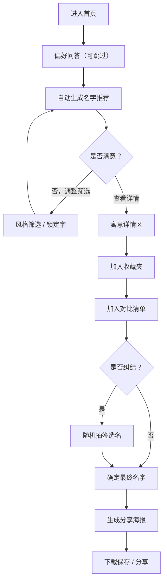

## 1. 产品概述

宠物起名工坊是一款面向准猫主/狗主的纯前端起名工具，通过交互式问答和多维度筛选帮助用户快速为宠物找到心仪的名字。无需注册登录，即开即用，支持生成多种风格名字、收藏对比、海报分享等功能。

- 核心价值：降低起名决策成本，提供有文化内涵和个性特色的名字方案
- 目标用户：准备养猫或养狗、对名字有品质追求的宠物主人

---

## 2. 核心功能

### 2.1 用户角色

无需注册登录，所有用户均为匿名访客，可使用全部功能。

| 角色 | 登录方式 | 核心权限 |
|------|----------|----------|
| 访客用户 | 无需登录 | 使用全部起名功能、本地存储收藏夹、生成分享海报 |

### 2.2 功能模块

单页应用，包含以下 7 大区域：

1. **偏好问答区**：品种、性别、毛色、性格、主人喜好等 5 道选择题
2. **名字推荐区**：根据偏好自动生成昵称、正式名、叠字名三类推荐
3. **风格筛选区**：按品种、性别、毛色、性格、主人喜好、字数、音节、中/英/日文风格筛选
4. **寓意详情区**：展示名字含义、读音、叫唤顺口度、重名热度、避讳提示
5. **收藏夹区**：批量收藏、删除、锁定字继续生成功能
6. **对比清单区**：多名字横向对比、随机抽签功能
7. **分享页区**：生成精美海报、一键下载分享

### 2.3 页面详情

| 区域名称 | 模块名称 | 功能描述 |
|----------|----------|----------|
| 偏好问答 | 品种选择 | 猫咪/狗狗细分品种下拉选择（如英短、布偶、金毛、柯基等） |
| 偏好问答 | 性别选择 | 公/母/未知三选一切换 |
| 偏好问答 | 毛色选择 | 预设色块选择（白/黑/黄/花/橘/灰/棕等） |
| 偏好问答 | 性格标签 | 多选标签（活泼/安静/粘人/高冷/贪吃/调皮/勇敢/胆小等） |
| 偏好问答 | 主人喜好 | 多选风格偏好（古风/可爱/霸气/文艺/搞怪/简约/日系/欧美等） |
| 名字推荐 | 分类切换 | 昵称/正式名/叠字名三个 Tab 切换 |
| 名字推荐 | 名字卡片 | 卡片展示名字+读音+标签，支持悬浮动效 |
| 名字推荐 | 换一批 | 保留筛选条件重新生成一组推荐 |
| 风格筛选 | 多维筛选 | 字数（1-4字）、音节（单/双/三音节）、语言风格（中/英/日） |
| 风格筛选 | 锁定字 | 输入框锁定某个字，重新生成时必须包含该字 |
| 寓意详情 | 名字释义 | 名字来源、含义、文化典故 |
| 寓意详情 | 读音展示 | 拼音/音标/假名标注 |
| 寓意详情 | 顺口度 | 5星评分条 + 描述说明 |
| 寓意详情 | 重名热度 | 热度条（热门/常见/小众/独特） |
| 寓意详情 | 避讳提示 | 与常见人名/不雅谐音冲突提示 |
| 收藏夹 | 批量收藏 | 名字卡片一键收藏，徽章显示数量 |
| 收藏夹 | 批量删除 | 勾选后批量删除，支持清空全部 |
| 收藏夹 | 锁定生成 | 从收藏夹选字进行锁定继续生成 |
| 对比清单 | 加入对比 | 最多支持 5 个名字加入横向对比 |
| 对比清单 | 对比表格 | 对比维度：含义、顺口度、热度、风格匹配度 |
| 对比清单 | 随机抽签 | 从对比清单中随机抽取一个名字作为"天意之选" |
| 分享页 | 海报生成 | Canvas 生成精美海报：宠物剪影+名字+寓意+二维码 |
| 分享页 | 风格选择 | 多种海报模板风格（温馨/酷炫/古风/可爱） |
| 分享页 | 下载分享 | 保存为 PNG 图片到本地 |

---

## 3. 核心流程

### 主流程描述
用户进入页面后，首先完成 5 道偏好问答（可跳过），系统根据偏好自动生成第一批名字推荐。用户可通过风格筛选和锁定字进一步细化，点击名字查看寓意详情，满意的名字加入收藏夹，可将多个名字加入对比清单进行横向比较，纠结时使用随机抽签功能，最终生成精美海报保存分享。

---

## 4. 用户界面设计

### 4.1 设计风格

**整体美学方向：温馨治愈 + 新日式杂货风**

- **主色调**：
  - 主色：奶油橘 `#F5A962`（温暖亲切，宠物毛色联想）
  - 辅色：薄荷绿 `#A8D8B9`（清新治愈）+ 奶咖棕 `#8B6F47`（稳重质感）
  - 背景色：奶油白 `#FFF9F2` + 浅米色纹理
  - 点缀色：樱粉 `#FFB6C1` / 天空蓝 `#B5D8EB`

- **按钮风格**：
  - 圆角胶囊按钮，轻微立体阴影
  - 主按钮为橘色渐变，hover 时轻微上浮 + 阴影加深
  - 次要按钮为描边样式，填充奶油白

- **字体选择**：
  - 标题字体：`ZCOOL KuaiLe` / `站酷快乐体`（活泼有童趣的中文手写体）
  - 正文字体：`Noto Serif SC` / `思源宋体`（文艺有质感，适合名字释义）
  - 英文名/数字：`Playfair Display`（优雅衬线体）

- **布局风格**：
  - 卡片式分区布局，卡片圆角 20px，米色轻阴影
  - 顶部导航为横向 Tab 滚动，平滑锚点跳转
  - 整体为纵向滚动单页，各区之间有微妙的波浪分隔条

- **图标/emoji 风格**：
  - 使用手绘风 SVG 图标（爪印、铃铛、鱼骨头、蝴蝶结等）
  - 名字卡片装饰使用 🐱🐶🦴🐟🎀 等 emoji 点缀

### 4.2 页面设计概览

| 区域名称 | 模块名称 | UI 元素描述 |
|----------|----------|-------------|
| 顶部导航 | 区域锚点 | 胶囊形横向 Tab，7 个区域快速跳转，当前区域高亮 |
| 偏好问答 | 问题卡片 | 每道题为独立卡片，进度条指示完成度，"跳过"按钮 |
| 名字推荐 | 名字卡片网格 | 响应式 3-4 列网格，卡片悬浮时上浮 + 旋转微动画，收藏心形按钮 |
| 风格筛选 | 筛选面板 | 折叠式筛选条，标签云形式，选中态为填充色 + 勾选标记 |
| 寓意详情 | 详情抽屉 | 从右侧滑出的抽屉式面板，名字大字居中，各项指标为进度条/星标 |
| 收藏夹 | 瀑布流列表 | 名字以标签形式排列，支持勾选，批量操作栏悬浮底部 |
| 对比清单 | 对比表格 | 横向可滚动表格，选中名字高亮，"开始抽签"按钮带脉冲动画 |
| 分享页 | 海报预览 | 居中海报预览区，下方模板选择缩略图，下载按钮带下载图标 |

### 4.3 响应式设计

- **设计原则**：Desktop-first，移动端自适应
- **桌面端（≥1024px）**：名字卡片 4 列，对比表格完整展示
- **平板端（768-1023px）**：名字卡片 3 列，部分面板改为上下布局
- **移动端（<768px）**：
  - 名字卡片 2 列布局
  - 顶部导航改为横向滚动
  - 详情抽屉改为底部弹出 Sheet
  - 对比表格改为卡片纵向堆叠对比
  - 触摸目标最小 44px

### 4.4 动效与交互

- **页面加载**：各区依次渐入，错峰 0.1s 延迟，名字卡片有弹性缩放入场
- **名字生成**：卡片从下往上滑入，每张卡片 stagger 延迟 50ms
- **收藏动画**：心形图标弹跳 + 粒子爆裂效果
- **抽签动画**：老虎机式滚动，最终名字放大高亮 + 彩带飘落
- **海报生成**：渐变闪光过渡效果
