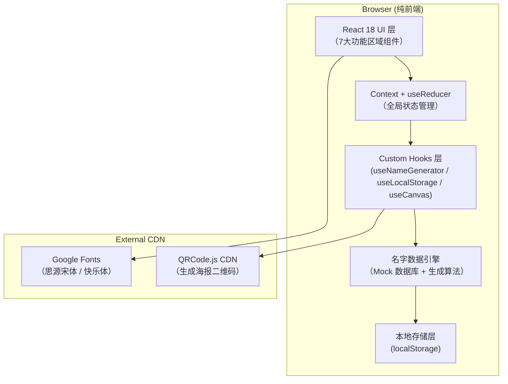
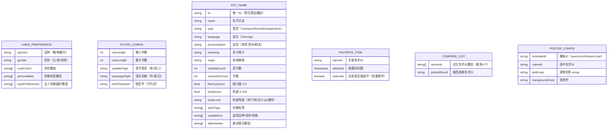

## 1. 架构设计



---

## 2. 技术说明

- **前端框架**：React@18 + React-DOM@18（函数组件 + Hooks）
- **初始化工具**：Vite@5（快速冷启动，HMR 热更新）
- **样式方案**：TailwindCSS@3 + CSS 变量（自定义主题）
- **状态管理**：React Context API + useReducer（无第三方依赖）
- **后端服务**：纯前端，无需后端
- **数据存储**：localStorage（收藏夹/偏好本地持久化）
- **图形绘制**：HTML5 Canvas API（海报生成）
- **二维码**：qrcode@1.5（npm 包，用于海报二维码生成）
- **图标方案**：内联 SVG 组件（手绘风，无外部依赖）
- **字体方案**：Google Fonts CDN（ZCOOL KuaiLe / Noto Serif SC / Playfair Display）

---

## 3. 路由定义

单页应用，无路由跳转，使用锚点 + 滚动定位实现区域导航。

| 锚点 ID | 区域名称 | 说明 |
|---------|----------|------|
| `#quiz` | 偏好问答 | 5 道选择题收集用户偏好 |
| `#recommend` | 名字推荐 | 三类名字卡片展示区 |
| `#filter` | 风格筛选 | 多维筛选器 + 锁定字 |
| `#detail` | 寓意详情 | 点击名字后展示的详情面板 |
| `#favorites` | 收藏夹 | 已收藏名字管理区 |
| `#compare` | 对比清单 | 横向对比表格 + 抽签 |
| `#share` | 分享页 | 海报预览 + 下载 |

---

## 4. 模块组件树

```
src/
├── App.jsx                          # 根组件（布局容器 + 全局 Provider）
├── main.jsx                         # 入口文件
├── index.css                        # 全局样式 + Tailwind 指令 + CSS 变量
├── context/
│   └── AppContext.jsx               # 全局 Context + Reducer（名字、筛选、收藏等状态）
├── hooks/
│   ├── useNameGenerator.js          # 名字生成算法 Hook（核心逻辑）
│   ├── useLocalStorage.js           # localStorage 持久化 Hook
│   └── useCanvasPoster.js           # Canvas 海报生成 Hook
├── data/
│   ├── nameDatabase.js              # 名字 Mock 数据库（中/英/日 千条+）
│   └── presetOptions.js             # 品种/毛色/性格等选项配置
├── components/
│   ├── layout/
│   │   ├── Navbar.jsx               # 顶部导航 Tab 栏
│   │   └── SectionWrapper.jsx       # 通用区域容器（波浪分隔+动画）
│   ├── quiz/
│   │   └── PreferenceQuiz.jsx       # 偏好问答 5 步骤组件
│   ├── recommend/
│   │   ├── RecommendSection.jsx     # 名字推荐区
│   │   ├── NameCard.jsx             # 单个名字卡片
│   │   └── CategoryTabs.jsx         # 昵称/正式名/叠字名 Tab
│   ├── filter/
│   │   ├── FilterPanel.jsx          # 风格筛选面板
│   │   └── LockCharInput.jsx        # 锁定字输入组件
│   ├── detail/
│   │   └── NameDetailDrawer.jsx     # 寓意详情抽屉
│   ├── favorites/
│   │   ├── FavoritesSection.jsx     # 收藏夹区
│   │   └── BatchActionBar.jsx       # 批量操作栏
│   ├── compare/
│   │   ├── CompareTable.jsx         # 对比表格
│   │   └── RandomPicker.jsx         # 随机抽签组件
│   └── share/
│       ├── PosterPreview.jsx        # 海报预览区
│       ├── TemplateSelector.jsx     # 海报模板选择器
│       └── DownloadButton.jsx       # 下载按钮
└── utils/
    ├── pinyin.js                    # 拼音/顺口度计算工具
    ├── heatScore.js                 # 重名热度评分算法
    └── tabooCheck.js                # 避讳检测工具
```

---

## 5. 数据模型

### 5.1 数据模型定义（ER 图）



### 5.2 名字数据库结构（Mock 数据）

**中文名字库**（约 500+ 条，分三类）：
- 昵称型：豆豆、奶糖、汤圆、饭团、布丁、可乐...
- 正式型：子墨、星辰、如意、清风、白云、雅婷...
- 叠字型：咪咪、汪汪、圆圆、乖乖、乐乐、萌萌...

**英文名字库**（约 300+ 条）：
- Lucky、Milo、Coco、Bella、Max、Luna、Oliver...

**日文名字库**（约 200+ 条）：
- モモ（Momo/桃子）、ココ（Koko/可可）、ハナ（Hana/花）...

每条名字包含：type、language、pronunciation、meaning、origin、fluencyScore、heatScore、styleTags、suitableFor、tabooNotes 等全量字段。

---

## 6. 核心算法说明

### 6.1 名字生成与匹配算法

```
输入: 用户偏好(UserPreference) + 筛选配置(FilterConfig)
输出: 排序后的推荐名字列表

步骤:
1. 根据 languageStyle 过滤中/英/日名字池
2. 根据 type 过滤昵称/正式名/叠字名分类池
3. 根据 characterCount 范围过滤字数
4. 根据 syllableCount 过滤音节数
5. 若 lockCharacter 非空，过滤包含该字的名字（中文）或匹配该子串（英文）
6. 计算匹配分 = Σ(styleTags ∩ stylePreferences) * 3
             + Σ(suitableFor ∩ coatColors/personalities/species) * 5
             + fluencyScore * 2
7. 按匹配分降序排列，取 Top 12
8. 引入确定性随机扰动（基于 seed），保证"换一批"有变化但可复现
```

### 6.2 顺口度评分算法

```
输入: 名字文本（中文）
输出: 0-5 分

规则:
1. 声调平仄交替 +1 分
2. 韵母开口度由大到小或由小到大变化（开口度: a>o>e>i>u>ü）+1 分
3. 无声母冲突（连续同声母）+1 分
4. 无韵母冲突（连续同韵母）+1 分
5. 最后一字为非去声（响亮结尾）+1 分
```

### 6.3 避讳检测算法

```
检查维度:
1. 与常见中文人名高度重复（前100大姓氏+前100大常用名）
2. 不雅谐音检测（内置谐音黑名单数组，用拼音匹配）
3. 与历史负面人物同名（内置名单）
4. 英文名字与知名品牌/商标高度重合
```

---

## 7. 性能与体验优化

| 优化点 | 方案 |
|--------|------|
| 首屏加载 | 名字数据分片懒加载，问答区先渲染，后台异步加载数据库 |
| 字体加载 | `font-display: swap` + 预连接 Google Fonts 域名 |
| 列表渲染 | 名字卡片使用 CSS 动画替代 JS 动画，`will-change: transform` |
| 状态更新 | Context 拆分，避免不必要的重渲染 |
| 图片资源 | 宠物剪影、海报模板均为 SVG 内联或 CSS 绘制，零图片请求 |
| Canvas 绘制 | 海报生成离屏 Canvas 预渲染，大尺寸图使用 `devicePixelRatio` 适配 |
